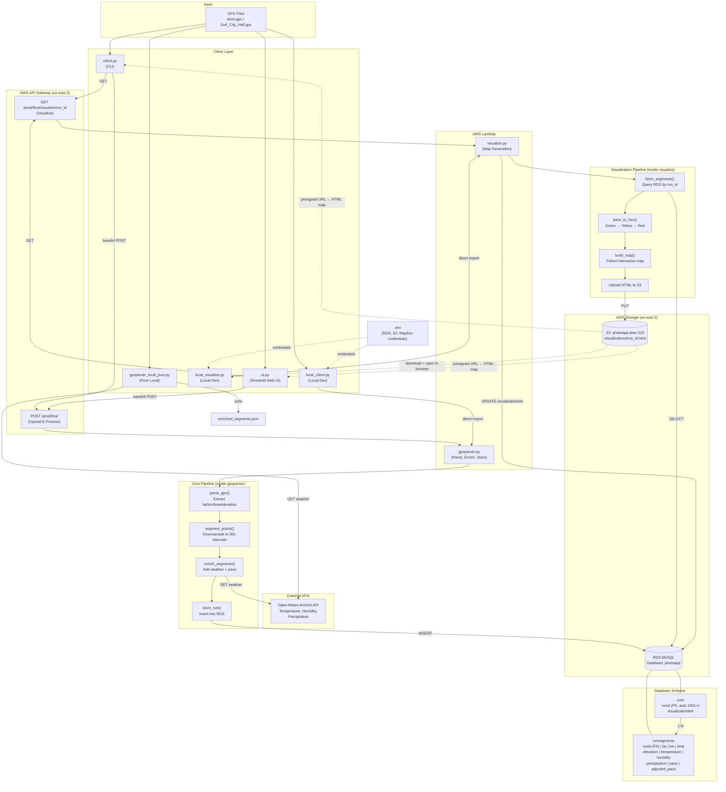

```mermaid
graph TB
    subgraph Clients["Client Layer"]
        CLI["client.py<br/>(CLI)"]
        UI["ui.py<br/>(Streamlit Web UI)"]
        LC["local_client.py<br/>(Local Dev)"]
        LV["local_visualize.py<br/>(Local Dev)"]
        LJ["gpxparser_local_json.py<br/>(Pure Local)"]
    end

    subgraph Input["Input"]
        GPX["GPX Files<br/>short.gpx / Surf_City_Half.gpx"]
    end

    subgraph AWS_Gateway["AWS API Gateway (us-east-2)"]
        POST_EP["POST /prod/final<br/>(Upload & Process)"]
        GET_EP["GET /prod/final/visualize/run_id<br/>(Visualize)"]
    end

    subgraph Lambda["AWS Lambda"]
        L1["gpxparser.py<br/>(Parse, Enrich, Store)"]
        L2["visualize.py<br/>(Map Generation)"]
    end

    subgraph Processing["Core Pipeline (inside gpxparser)"]
        P1["parse_gpx()<br/>Extract lat/lon/time/elevation"]
        P2["segment_points()<br/>Downsample to 30s intervals"]
        P3["enrich_segments()<br/>Add weather + pace"]
        P4["store_run()<br/>Insert into RDS"]
    end

    subgraph Viz["Visualization Pipeline (inside visualize)"]
        V1["fetch_segments()<br/>Query RDS by run_id"]
        V2["pace_to_hex()<br/>Green → Yellow → Red"]
        V3["build_map()<br/>Folium interactive map"]
        V4["Upload HTML to S3"]
    end

    subgraph External["External APIs"]
        METEO["Open-Meteo Archive API<br/>Temperature, Humidity,<br/>Precipitation"]
    end

    subgraph AWS_Storage["AWS Storage (us-east-2)"]
        RDS[("RDS MySQL<br/>Database: photoapp")]
        S3[("S3: photoapp-alan-310<br/>visualizations/run_id.html")]
    end

    subgraph DB["Database Schema"]
        RUNS["runs<br/>runid (PK, auto 1001+)<br/>visualizationlink"]
        SEGS["runsegments<br/>runid (FK) | lat | lon | time<br/>elevation | temperature | humidity<br/>precipitation | pace | adjusted_pace"]
    end

    ENV[".env<br/>(RDS, S3, Mapbox credentials)"]

    %% Input flows
    GPX --> CLI
    GPX --> UI
    GPX --> LC
    GPX --> LJ

    %% Cloud path - Upload
    CLI -- "base64 POST" --> POST_EP
    UI -- "base64 POST" --> POST_EP
    POST_EP --> L1

    %% Local path - Upload
    LC -- "direct import" --> L1

    %% Processing pipeline
    L1 --> P1 --> P2 --> P3 --> P4
    P3 -- "GET weather" --> METEO
    P4 -- "INSERT" --> RDS

    %% Cloud path - Visualize
    CLI -- "GET" --> GET_EP
    UI -- "GET" --> GET_EP
    GET_EP --> L2

    %% Local path - Visualize
    LV -- "direct import" --> L2
    ENV -. "credentials" .-> LV
    ENV -. "credentials" .-> LC

    %% Visualization pipeline
    L2 --> V1 --> V2 --> V3 --> V4
    V1 -- "SELECT" --> RDS
    V4 -- "PUT" --> S3
    L2 -- "UPDATE visualizationlink" --> RDS

    %% Pure local path
    LJ -- "GET weather" --> METEO
    LJ -- "write" --> JSON["enriched_segments.json"]

    %% DB relationship
    RDS --- RUNS
    RDS --- SEGS
    RUNS -- "1:N" --> SEGS

    %% Response flows
    S3 -. "presigned URL → HTML map" .-> CLI
    S3 -. "presigned URL → HTML map" .-> UI
    S3 -. "download + open in browser" .-> LV
```
